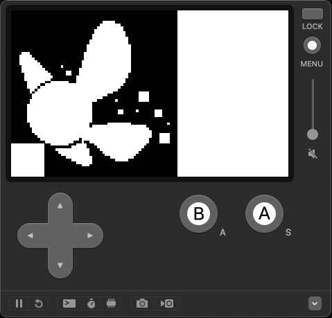

# Image Shuffle Puzzle Game using C API



## Getting Started

### Prerequisites

- Playdate SDK installed
- ARM GCC toolchain installed

### Building the Project

1. Clone the repository:

```bash
git clone git@github.com/kennycason/image-shuffle-playdate.git
cd image-shuffle-playdate
```

2. Build the project:

```bash
make
```

3. Run in the Playdate Simulator:

```bash
make run
```

## Controls

- **Button A:** Shuffle the image